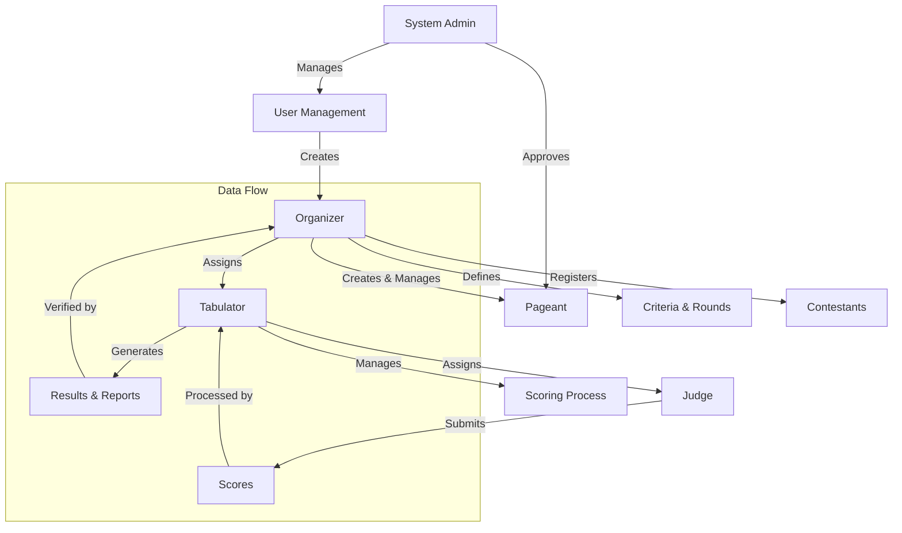
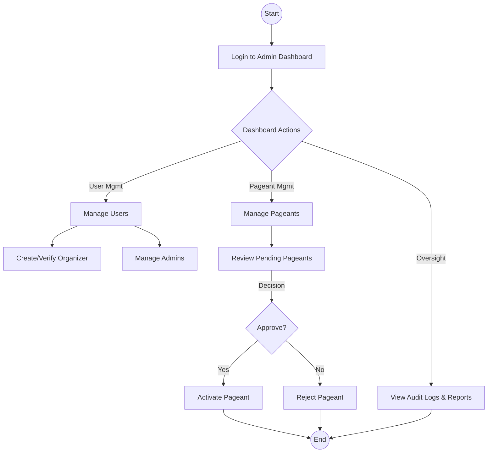
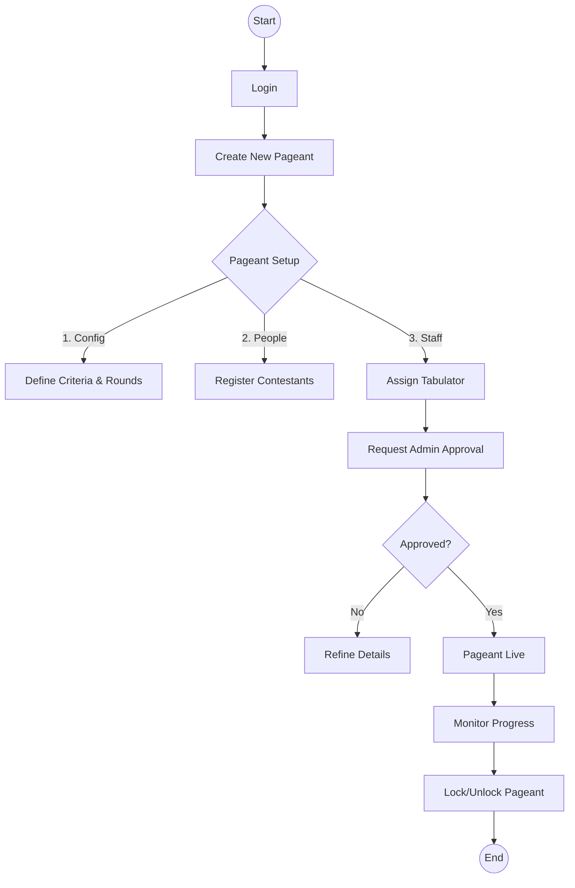
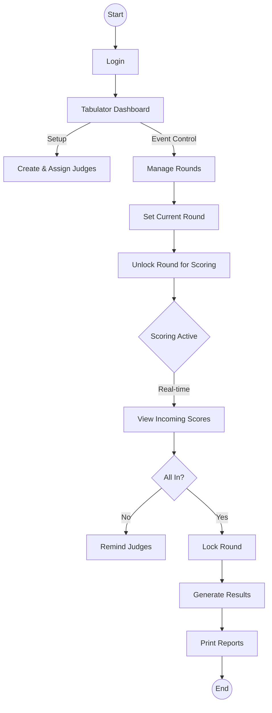
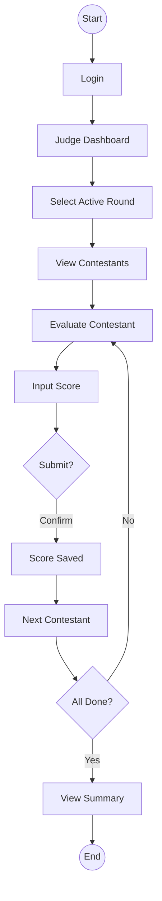
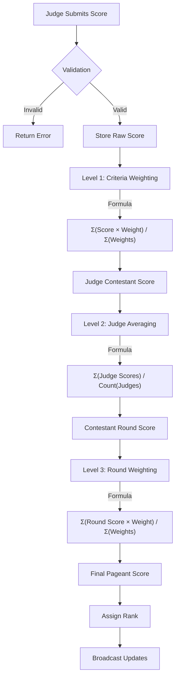

# Tabulation System Flow Charts by User Role

This document contains detailed flow charts for the Tabulation System, separated by user role. Each section is designed to fit on a standard letter-sized paper (8.5" x 11").

---

## Part 1: System Hierarchy & Overview

### System Hierarchy

### User Roles Summary

| Role | Primary Responsibility | Key Actions |
|------|------------------------|-------------|
| **Admin** | System Oversight | Manage users, Approve pageants, View audit logs |
| **Organizer** | Pageant Management | Create pageants, Setup criteria/rounds, Manage contestants |
| **Tabulator** | Scoring Operations | Manage judges, Monitor scoring, Print results |
| **Judge** | Evaluation | Score contestants, View contestant details |

---

## Part 2: Admin Workflow

### Admin Process Flow

The Admin is responsible for the integrity of the system and the approval of events.

### Key Admin Tasks
1.  **User Management**: Create and verify Organizer accounts.
2.  **Pageant Approval**: Review and approve pageants created by Organizers before they can go live.
3.  **System Monitoring**: View audit logs and system reports to ensure fair play.

---

## Part 3: Organizer Workflow

### Organizer Process Flow

The Organizer sets up the entire configuration for a specific pageant.

### Key Organizer Tasks
1.  **Pageant Creation**: Define the event details (Title, Date, Venue).
2.  **Criteria & Rounds**: Set up the scoring criteria (e.g., "Beauty 50%", "Intelligence 50%") and rounds (e.g., "Swimwear", "Q&A").
3.  **Contestant Management**: Add contestant profiles and photos.
4.  **Staffing**: Create and assign Tabulator accounts to the pageant.

---

## Part 4: Tabulator Workflow

### Tabulator Process Flow

The Tabulator manages the live scoring event and ensures judges are ready.

### Key Tabulator Tasks
1.  **Judge Management**: Create Judge accounts and assign them to the pageant.
2.  **Round Control**: Control which round is currently active and open for scoring.
3.  **Result Generation**: Monitor scores in real-time, lock rounds when finished, and print official results.

---

## Part 5: Judge Workflow

### Judge Process Flow

The Judge focuses solely on evaluating the contestants.

### Key Judge Tasks
1.  **Scoring**: Enter scores for each contestant based on the active round's criteria.
2.  **Review**: View a summary of their submitted scores.
3.  **Comparison**: (Optional) Compare contestants to ensure fair scoring.

---

## Part 6: Scoring Calculation Logic

### Score Processing Flow

This diagram illustrates how a single judge's score is processed into a final pageant score.

### Calculation Steps
1.  **Judge Input**: Judge submits a score for a specific criteria.
2.  **Level 1 (Judge-Contestant)**: All criteria scores from one judge for one contestant are weighted and averaged.
3.  **Level 2 (Contestant-Round)**: The weighted scores from all judges for that contestant in that round are averaged.
4.  **Level 3 (Final Score)**: The round scores for that contestant are weighted by round importance to produce the final score.
