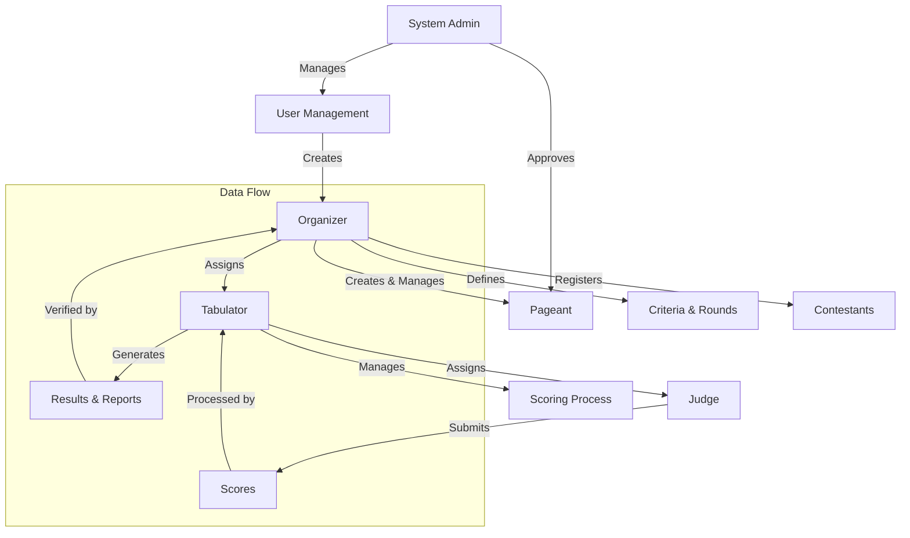
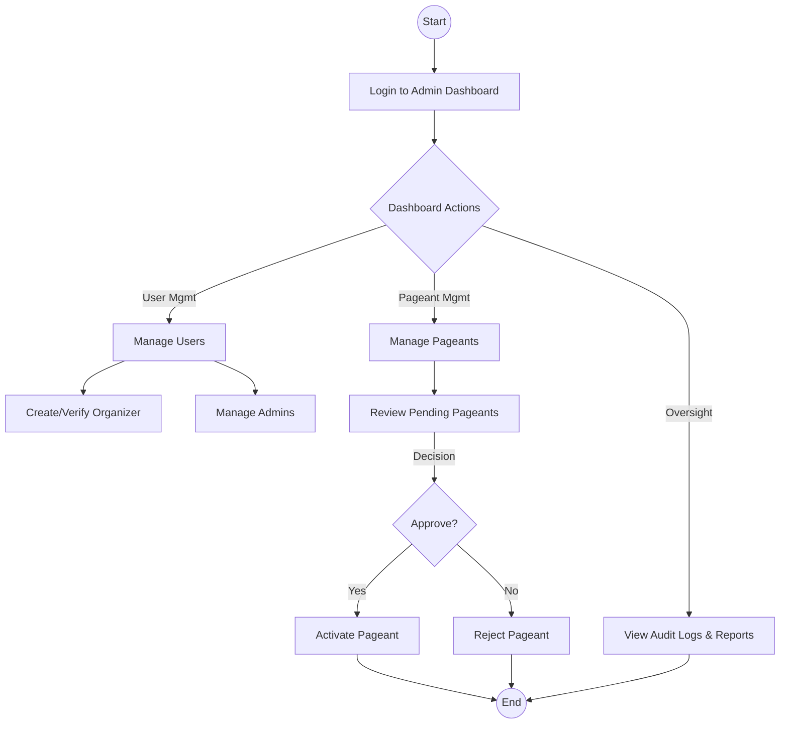
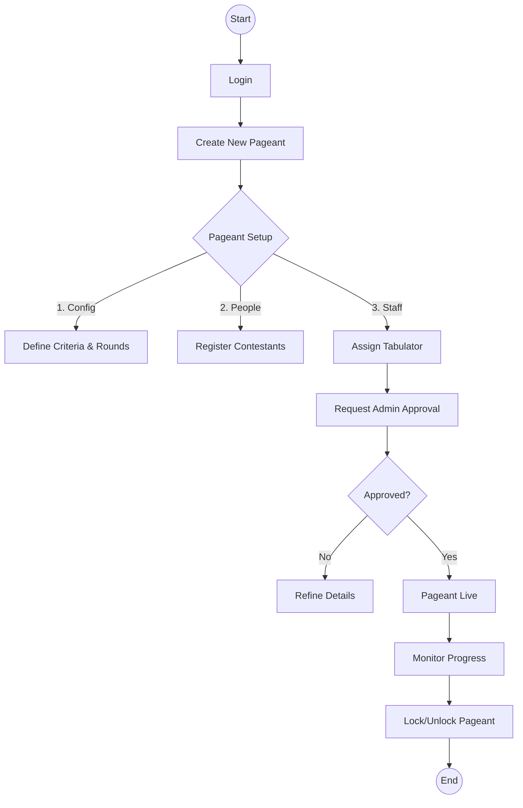
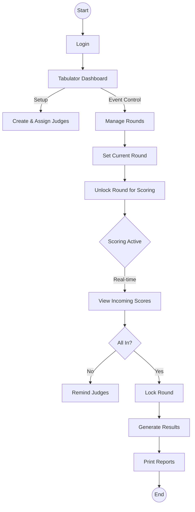
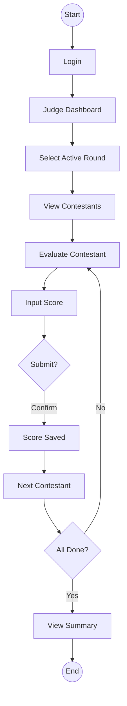

# Program Hierarchy and Flow Charts

This document outlines the hierarchy and workflow of the Tabulation System, divided by user roles. Each section is designed to fit on a standard letter-sized paper (8.5" x 11") when printed.

> **Note:** If you cannot see the diagrams below, please install the "Markdown Preview Mermaid Support" extension in VS Code, or refer to the text-based descriptions provided under each diagram.

---

## Part 1: System Hierarchy & Overview

### System Hierarchy

The system operates on a hierarchical structure ensuring secure management of pageants and scoring.

#### Text Representation (Hierarchy)
*   **System Admin**
    *   Manages -> **User Management** -> Creates -> **Organizer**
    *   Approves -> **Pageant**
*   **Organizer**
    *   Creates & Manages -> **Pageant**
    *   Defines -> **Criteria & Rounds**
    *   Registers -> **Contestants**
    *   Assigns -> **Tabulator**
*   **Tabulator**
    *   Manages -> **Scoring Process**
    *   Assigns -> **Judge** -> Submits -> **Scores**
    *   Generates -> **Results & Reports**

### User Roles Summary

| Role | Primary Responsibility | Key Actions |
|------|------------------------|-------------|
| **Admin** | System Oversight | Manage users, Approve pageants, View audit logs |
| **Organizer** | Pageant Management | Create pageants, Setup criteria/rounds, Manage contestants |
| **Tabulator** | Scoring Operations | Manage judges, Monitor scoring, Print results |
| **Judge** | Evaluation | Score contestants, View contestant details |

---

## Part 2: Admin Workflow

### Admin Process Flow

The Admin is responsible for the integrity of the system and the approval of events.

#### Text Representation (Admin Flow)
1.  **Start** -> Login to Admin Dashboard
2.  **Dashboard Actions**:
    *   *User Management* -> Manage Users -> Create/Verify Organizer OR Manage Admins
    *   *Pageant Management* -> Manage Pageants -> Review Pending Pageants
        *   **Decision**: Approve?
            *   **Yes**: Activate Pageant -> End
            *   **No**: Reject Pageant -> End
    *   *Oversight* -> View Audit Logs & Reports -> End

### Key Admin Tasks
1.  **User Management**: Create and verify Organizer accounts.
2.  **Pageant Approval**: Review and approve pageants created by Organizers before they can go live.
3.  **System Monitoring**: View audit logs and system reports to ensure fair play.

---

## Part 3: Organizer Workflow

### Organizer Process Flow

The Organizer sets up the entire configuration for a specific pageant.

#### Text Representation (Organizer Flow)
1.  **Start** -> Login
2.  Create New Pageant
3.  **Pageant Setup**:
    *   Define Criteria & Rounds
    *   Register Contestants
    *   Assign Tabulator
4.  Request Admin Approval
5.  **Approved?**
    *   **No**: Refine Details (Go back to Setup)
    *   **Yes**: Pageant Live
6.  Monitor Progress -> Lock/Unlock Pageant -> End

### Key Organizer Tasks
1.  **Pageant Creation**: Define the event details (Title, Date, Venue).
2.  **Criteria & Rounds**: Set up the scoring criteria (e.g., "Beauty 50%", "Intelligence 50%") and rounds (e.g., "Swimwear", "Q&A").
3.  **Contestant Management**: Add contestant profiles and photos.
4.  **Staffing**: Create and assign Tabulator accounts to the pageant.

---

## Part 4: Tabulator Workflow

### Tabulator Process Flow

The Tabulator manages the live scoring event and ensures judges are ready.

#### Text Representation (Tabulator Flow)
1.  **Start** -> Login -> Tabulator Dashboard
2.  **Setup**: Create & Assign Judges
3.  **Event Control**:
    *   Manage Rounds -> Set Current Round
    *   Unlock Round for Scoring
4.  **Scoring Active**:
    *   View Incoming Scores
    *   **All Scores In?**
        *   **No**: Remind Judges
        *   **Yes**: Lock Round
5.  Generate Results -> Print Reports -> End

### Key Tabulator Tasks
1.  **Judge Management**: Create Judge accounts and assign them to the pageant.
2.  **Round Control**: Control which round is currently active and open for scoring.
3.  **Result Generation**: Monitor scores in real-time, lock rounds when finished, and print official results.

---

## Part 5: Judge Workflow

### Judge Process Flow

The Judge focuses solely on evaluating the contestants.

#### Text Representation (Judge Flow)
1.  **Start** -> Login -> Judge Dashboard
2.  Select Active Round -> View Contestants
3.  Evaluate Contestant -> Input Score
4.  **Submit?** -> Confirm -> Score Saved
5.  Next Contestant
6.  **All Done?**
    *   **No**: Evaluate next contestant
    *   **Yes**: View Summary -> End

### Key Judge Tasks
1.  **Scoring**: Enter scores for each contestant based on the active round's criteria.
2.  **Review**: View a summary of their submitted scores.
3.  **Comparison**: (Optional) Compare contestants to ensure fair scoring.
